ABSTRACT: Self-assembly and structural ordering is a complex, emergent property of liquids that is intimately related to macroscopic and microscopic phenomenon. A foremost objective of modern research in liquid state physics is the development and optimization of computer simulations that can accurately predict the behavior of materials from the atomic scale for any arbitrary system, and we expect such models to closely agree with experimental measurements of macroscopic behavior (PV diagrams, heat capacity, etc) and microscopic behavior (pair correlation functions, diffusion coefficients, etc). Common quantum simulation methods employ empirical correction schemes on top of classical simulations to better fit a particular macro/microscopic observable. This can lead optimized pair potentials to severely over fit to one particular thermodynamic state. This has lead researchers to pursue simulation methods that can better represent the physics of the liquid state without the need for empirical correction. A rigorous way of doing this is through the use of quantum mechanics and the path integral. The aim of this review is to convince newcomers of the power of path integral simulations as well as reveal the often overlooked theoretical background of quantum simulation. 

To view this project please click on the PDF link above. 


The goal of a Variational Autoencoder is to create a generative model, such that we can call it and it will generate a sample that mimics the training dataset. Variational Autoencoders make the assumption that each of the samples $ \mathbf x_i$ from the data set $\mathbf{D}$ are iid and generated from the same probability distribution. Along with this, each sample has an latent feature vector $\mathbf{z}_i$. This implies the existence of a full joint distribution $p(\mathbf{x},\mathbf{z})$. When creating a generative model we are trying to discover the distribution $p(\mathbf x | \mathbf z)$, whereas when creating a discriminative model we are trying to discover the distribution $p(\mathbf{z}|\mathbf{x})$. VAEs are an attempt to utilize this latent structure to make optimization easier.

To start, let us first get our imports as well as our datset. For the purpose of this tutorial we will be using the MNIST dataset. 


```python
import matplotlib.pyplot as plt                    
import numpy as np                                 
import torch as torch                              
import torchvision.datasets as datasets
from torchvision.transforms import ToTensor 
from torch.utils.data import Dataset, DataLoader
import torch.nn as nn
import torch.nn.functional as F
import torch.optim as optim


class data(Dataset):
    
  def __init__(self, X, Y):
    self.X = X
    self.Y = Y
    if len(self.X) != len(self.Y):
      raise Exception("len(X) != len(Y)")

  def __len__(self):
    return len(self.X)

  def __getitem__(self, index):
    _x = self.X[index].unsqueeze(dim=0)
    _y = self.Y[index].unsqueeze(dim=0)

    return _x, _y

# Importing MNIST
mnist_trainset = datasets.MNIST(root='./data', train=True, download=True, transform=ToTensor())
mnist_testset = datasets.MNIST(root='./data', train=True, download=True, transform=ToTensor())

bs = 200

# Data Loader
train_loader = torch.utils.data.DataLoader(dataset=mnist_trainset, batch_size=bs, shuffle=True)
test_loader = torch.utils.data.DataLoader(dataset=mnist_testset, batch_size=bs, shuffle=False)
```

Lets consider what a particular sample from the dataset represents. We can take the image and then reshape it into a vector. Lets represent a particular sample by the symbol $\mathbf x_i$. We can represnt the probability of that element by assuming it is conditioned on some feature variable $\mathbf z_i$. 

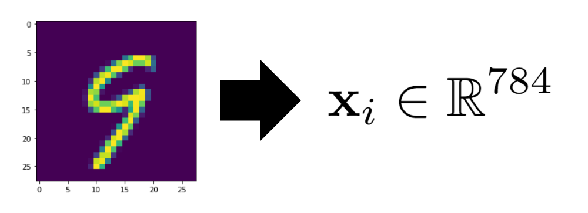

I am not interested in learning the distribution of $p(\mathbf x|\mathbf \phi)$ itself. Rather I want to know the conditionals $p(\mathbf x | \mathbf z, \mathbf \phi)$ and $p(\mathbf z| \mathbf x, \mathbf \phi)$. Where $\mathbf z$ is a "feature" space. This allows us to use the generative nature of $p(\mathbf x | \mathbf z, \mathbf \phi)$. We can choose a particular set of features $\mathbf z$ and then see which $\mathbf x$ probabilistically corresponds to it. Through all this we are then asserting that there exists a total joint distribution $p(\mathbf x, \mathbf z| \mathbf \phi)$.  It is related to the conditionals through the following expression. Noting that $\mathbf \phi$ will represent the parameters of our model.

$$
p(\mathbf x|\mathbf \phi) = \int p(\mathbf{x},\mathbf{z}|\mathbf \phi) d\mathbf{z}
$$

Sadly, I will be restricting our use of the actual image labels in MNIST. This is to make this more generic to image generation in general. We only have observed samples from $p(\mathbf x|\mathbf \phi)$. We can then write the objection fuction using a maximum likelihood treatment as:

$$
\log p(\mathbf x|\mathbf \phi) = \log \bigg[\int p(\mathbf{x},\mathbf{z}|\mathbf \phi) d\mathbf{z}\bigg]
$$

Sadly the integral in the equation above makes it quite difficult to deal with. Therefore, we can instead make an approximate model for this system by using two neural networks. One of these networks will be the encoder, the $p(\mathbf x|\mathbf \phi)$ that we have seen thus far, and the other will be a decoder. I am going to use the function $q(\mathbf x |\mathbf z, \mathbf \theta)$ to represent the decoder where $\mathbf \theta$ are the network parameters.  Similarly, the decoder will be $q(\mathbf z |\mathbf x, \mathbf \theta)$. 

$$
\mathbf \mu, \mathbf \Sigma = \text{Encoder}_\theta(\mathbf x) \\
q(\mathbf z |\mathbf x, \mathbf \theta) = \mathcal{N}(\mathbf z | \mathbf \mu, \mathbf \Sigma)
$$

Then notice that we can write the objective function can then be written as: 

$$
\log p(\mathbf x |\mathbf \phi) = \mathbb{E}_{q(\mathbf z |\mathbf x, \mathbf \theta)}[\log p(\mathbf x |\mathbf \phi)]
$$

Because the integral introduced by the expectation doesn't depend on $\mathbb x$ we can just take it out and let $q(\mathbf z |\mathbf x, \mathbf \theta)$ integrate itself to 1. This expression alows for more decomposition.

$$
\mathbb{E}_{q(\mathbf z |\mathbf x, \mathbf \theta)}\bigg[\log p(\mathbf x |\mathbf \phi)\bigg] = \mathbb{E}_{q(\mathbf z |\mathbf x, \mathbf \theta)}\bigg[\log\bigg( \frac{p(\mathbf x,\mathbf z |\mathbf \phi) }{p(\mathbf z|\mathbf \phi,\mathbf x)}\bigg) \bigg] \\
$$

This is because the marginalized probability can be written in terms of the joint and a conditional. Further then we can simply multiply the top and bottom by the same quantitiy and separate the logarithm into a sum. 

$$
 = \mathbb{E}_{q(\mathbf z |\mathbf x, \mathbf \theta)}\bigg[\log\bigg( \frac{p(\mathbf x,\mathbf z|\mathbf \phi)q(\mathbf z |\mathbf x, \mathbf \theta)}{p(\mathbf z|\mathbf \phi, \mathbf x)q(\mathbf z |\mathbf x, \mathbf \theta)}\bigg) \bigg] \\
= \mathbb{E}_{q(\mathbf z |\mathbf x, \mathbf \theta)}\bigg[\log\bigg( \frac{p(\mathbf x,\mathbf z|\mathbf \phi)}{q(\mathbf z |\mathbf x, \mathbf \theta)}\bigg) \bigg] + \mathbb{E}_{q(\mathbf z |\mathbf x, \mathbf \theta)}\bigg[\log\bigg( \frac{q(\mathbf z |\mathbf x, \mathbf \theta)}{p(\mathbf z|\mathbf \phi, \mathbf x)}\bigg) \bigg] \\
$$

We can recognize the second expectation as the KL divergence between our network model and the true distribution. The KL divergence is strictly positive, therefore we can view the first expectation as an evidence based lower bound (ELBO) of the true likelihood of the data. If we maximize the lower bound we will be also maximizing the probaility of the data. This totally reframes the problem of inference. 

$$
\text{ELBO} = \mathbb{E}_{q(\mathbf z |\mathbf x, \mathbf \theta)}\bigg[\log\bigg( \frac{p(\mathbf x,\mathbf z)}{q(\mathbf z |\mathbf x, \mathbf \theta)}\bigg) \bigg] =  \mathbb{E}_{q(\mathbf z |\mathbf x, \mathbf \theta)}\bigg[\log p(\mathbf x,\mathbf z) \bigg] -  \mathbb{E}_{q(\mathbf z |\mathbf x, \mathbf \theta)}\bigg[\log q(\mathbf z |\mathbf x, \mathbf \theta)\bigg] \\ 
 = \mathbb{E}_{q(\mathbf z |\mathbf x, \mathbf \theta)}\bigg[\log p(\mathbf x| \mathbf z, \mathbf \phi)p(\mathbf z) \bigg] -  \mathbb{E}_{q(\mathbf z |\mathbf x, \mathbf \theta)}\bigg[\log q(\mathbf z |\mathbf x, \mathbf \theta)\bigg] \\ 
$$

 We can then take $p(\mathbf z)$ as a prior distribution of our data. Let us choose that as a standard normal $\mathcal{N}(\mathbf z | \mathbf \mu = \mathbf 0, \mathbf \Sigma = \mathbf I)$. This lets us write our expression out as follows:
 
 $$
 = \mathbb{E}_{q(\mathbf z |\mathbf x, \mathbf \theta)}\bigg[\log p(\mathbf x| \mathbf z, \mathbf \phi)\bigg] + \mathbb{E}_{q(\mathbf z |\mathbf x, \mathbf \theta)}\bigg[\log p(\mathbf z)\bigg] -  \mathbb{E}_{q(\mathbf z |\mathbf x, \mathbf \theta)}\bigg[\log q(\mathbf z |\mathbf x, \mathbf \theta)\bigg] \\ 
 = \mathbb{E}_{q(\mathbf z |\mathbf x, \mathbf \theta)}\bigg[\log p(\mathbf x| \mathbf z, \mathbf \phi)\bigg] + \mathbb{E}_{q(\mathbf z |\mathbf x, \mathbf \theta)}\bigg[\log( p(\mathbf z)/q(\mathbf z |\mathbf x, \mathbf \theta))\bigg]
 $$
 
 Then the second term corresponds to the negative KL divergence between the prior and our model. Remeber we asserted $q(\mathbf z |\mathbf x, \mathbf \theta)$ is normal. Making that part of the expression quite simple. We can then assert that the generative distribution is also gaussian. We can choose our network to just calculate the mean value. This makes the probability of a training set become the MSE loss. 


```python
recon_error = nn.MSELoss(reduction='sum')
def variational_loss(p_x,x,μ_qz,log_var_qz,ϵ,z):
    KL = -0.5 * torch.sum(log_var_qz - μ_qz.pow(2) - log_var_qz.exp()) # - KL Divergece between standard normal and current p(z) and q(z|x)
    return recon_error(p_x,x) + KL 
```

Now we need to discuss backpropigation within this network. When we are computing our loss function, it has to be taken as the expecation with respect to $q(\mathbf z |\mathbf x, \mathbf \theta)$. This means we must use a monte carlo estimate to evaluate the expectation as the integral is intractable. However this makes backpropigation impossible, we cant backprop through a random variable. Therefore we may reparameterize the randomness into some dummy variable $\epsilon$. Because our distribution is gaussian, we may simply choose $\epsilon$ as a standard normal and use the network output to rescale it. As for the network, we will keep it simple and just do three layers for the encoder and 3 for the deconder. See the implementation below.


```python
class VAE(nn.Module):

    def __init__(self):
        super(VAE,self).__init__()
        
        # define encoder layers
        self.e_dense1 = nn.Linear(784,64)
        self.e_dense2 = nn.Linear(64, 32)
        self.e_dense3 = nn.Linear(32, 8)
        
        # define dencoder layers
        self.d_dense1 = nn.Linear(4,32)
        self.d_dense2 = nn.Linear(32, 64)
        self.d_dense3 = nn.Linear(64, 784)


    def encode(self, x):
        x = torch.relu(self.e_dense1(x))
        x = torch.relu(self.e_dense2(x))
        x = (self.e_dense3(x))
        return x[:,:4],x[:,4:]
    
    def sample(self,μ,log_var):
        σ = torch.exp(0.5*log_var)
        ϵ = torch.randn_like(σ) # Sample from epsilon
        return μ + ϵ.mul(σ),ϵ # transform epsilon into z sample
    
    def decode(self, x):
        x = torch.relu(self.d_dense1(x))
        x = torch.relu(self.d_dense2(x))
        x = torch.sigmoid(self.d_dense3(x))
        return x
    
    def forward(self,x):
        μ_qz,log_var_qz = self.encode(x)
        z,ϵ = self.sample(μ_qz,log_var_qz)
        p_x = self.decode(z)
        return p_x,μ_qz,log_var_qz,ϵ,z
```

Now we can instantiate our model and run it!!


```python
vae = VAE()
optimizer = optim.Adam(vae.parameters())
criterion = variational_loss
```


```python
for epoch in range(50):  # loop over the dataset multiple times

    total_loss = 0.0
    for i, data in enumerate(train_loader,start = 1):
        
        inputs = data[0].flatten(start_dim=1)

        # zero the parameter gradients
        optimizer.zero_grad()
        
        # forward + backward + optimize
        p_x,μ_qz,log_var_qz,ϵ,z = vae(inputs)
        loss = criterion(p_x,inputs,μ_qz,log_var_qz,ϵ,z)
        loss.backward()
        optimizer.step()
        
        total_loss += loss.item()
    
        if i % 100 == 0:
            print('Epoch: {} [{}/{} ({:.0f}%)]\tLoss: {:.6f}'.format(
                epoch, i * len(inputs), len(train_loader.dataset),
                (100*(len(inputs) * i) / len(train_loader.dataset)), loss.item() / len(inputs)))
            
    sample_idx = np.random.randint(len(mnist_trainset))
    μ,σ = vae.encode(torch.stack((mnist_trainset[sample_idx][0].flatten(),mnist_trainset[sample_idx][0].flatten())))
    z,ϵ = vae.sample(μ,σ)
    x = vae.decode(z.unsqueeze(dim=1))
    plt.imshow(x[1].detach().numpy().reshape(28,28))
    plt.title(mnist_trainset[sample_idx][1])
    plt.show()
            
    print('====> Epoch: {} Average loss: {:.4f}'.format(epoch, total_loss / len(train_loader.dataset)))
    
        
print('Finished Training')
```

    Epoch: 0 [20000/60000 (33%)]	Loss: 56.698457
    Epoch: 0 [40000/60000 (67%)]	Loss: 54.966836
    Epoch: 0 [60000/60000 (100%)]	Loss: 53.562334
    


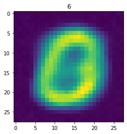


    ====> Epoch: 0 Average loss: 66.2929
    Epoch: 1 [20000/60000 (33%)]	Loss: 51.518516
    Epoch: 1 [40000/60000 (67%)]	Loss: 50.127305
    Epoch: 1 [60000/60000 (100%)]	Loss: 47.599878
    


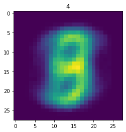


    ====> Epoch: 1 Average loss: 50.3971
    Epoch: 2 [20000/60000 (33%)]	Loss: 46.609116
    Epoch: 2 [40000/60000 (67%)]	Loss: 44.889531
    Epoch: 2 [60000/60000 (100%)]	Loss: 43.474600
    


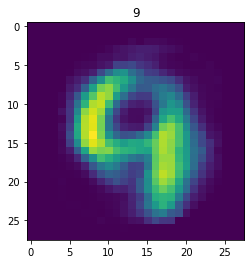


    ====> Epoch: 2 Average loss: 46.2344
    Epoch: 3 [20000/60000 (33%)]	Loss: 42.524268
    Epoch: 3 [40000/60000 (67%)]	Loss: 41.891636
    Epoch: 3 [60000/60000 (100%)]	Loss: 41.541118
    


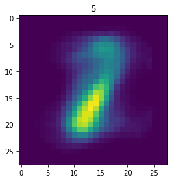


    ====> Epoch: 3 Average loss: 42.6844
    Epoch: 4 [20000/60000 (33%)]	Loss: 41.212432
    Epoch: 4 [40000/60000 (67%)]	Loss: 40.988394
    Epoch: 4 [60000/60000 (100%)]	Loss: 40.674072
    


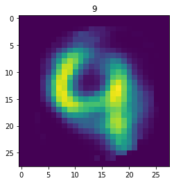


    ====> Epoch: 4 Average loss: 41.3674
    Epoch: 5 [20000/60000 (33%)]	Loss: 39.347095
    Epoch: 5 [40000/60000 (67%)]	Loss: 39.964746
    Epoch: 5 [60000/60000 (100%)]	Loss: 39.661968
    


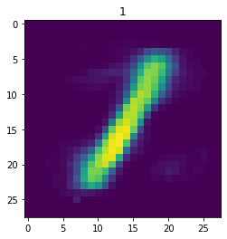


    ====> Epoch: 5 Average loss: 40.5180
    Epoch: 6 [20000/60000 (33%)]	Loss: 39.077688
    Epoch: 6 [40000/60000 (67%)]	Loss: 38.294802
    Epoch: 6 [60000/60000 (100%)]	Loss: 38.347146
    


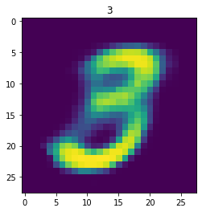


    ====> Epoch: 6 Average loss: 39.9005
    Epoch: 7 [20000/60000 (33%)]	Loss: 40.272634
    Epoch: 7 [40000/60000 (67%)]	Loss: 39.569946
    Epoch: 7 [60000/60000 (100%)]	Loss: 38.919097
    


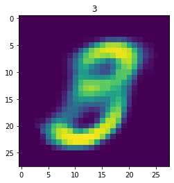


    ====> Epoch: 7 Average loss: 39.3812
    Epoch: 8 [20000/60000 (33%)]	Loss: 38.082427
    Epoch: 8 [40000/60000 (67%)]	Loss: 38.717292
    Epoch: 8 [60000/60000 (100%)]	Loss: 37.672859
    


    ====> Epoch: 8 Average loss: 38.9434
    Epoch: 9 [20000/60000 (33%)]	Loss: 37.330728
    Epoch: 9 [40000/60000 (67%)]	Loss: 37.700049
    Epoch: 9 [60000/60000 (100%)]	Loss: 37.563271
    


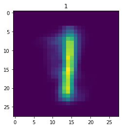


    ====> Epoch: 9 Average loss: 38.5736
    Epoch: 10 [20000/60000 (33%)]	Loss: 37.702485
    Epoch: 10 [40000/60000 (67%)]	Loss: 38.086489
    Epoch: 10 [60000/60000 (100%)]	Loss: 37.647063
    


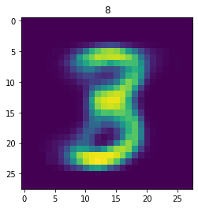


    ====> Epoch: 10 Average loss: 38.2347
    Epoch: 11 [20000/60000 (33%)]	Loss: 37.480168
    Epoch: 11 [40000/60000 (67%)]	Loss: 36.328479
    Epoch: 11 [60000/60000 (100%)]	Loss: 37.478169
    


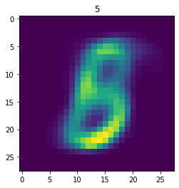


    ====> Epoch: 11 Average loss: 37.9565
    Epoch: 12 [20000/60000 (33%)]	Loss: 37.965278
    Epoch: 12 [40000/60000 (67%)]	Loss: 38.572202
    Epoch: 12 [60000/60000 (100%)]	Loss: 36.891362
    


    ====> Epoch: 12 Average loss: 37.7104
    Epoch: 13 [20000/60000 (33%)]	Loss: 37.276660
    Epoch: 13 [40000/60000 (67%)]	Loss: 37.544507
    Epoch: 13 [60000/60000 (100%)]	Loss: 36.613884
    


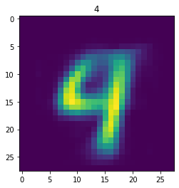


    ====> Epoch: 13 Average loss: 37.5024
    Epoch: 14 [20000/60000 (33%)]	Loss: 37.619067
    Epoch: 14 [40000/60000 (67%)]	Loss: 37.133477
    Epoch: 14 [60000/60000 (100%)]	Loss: 37.386440
    


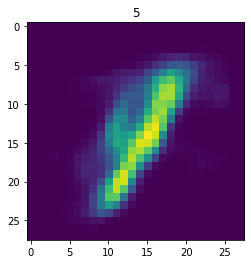


    ====> Epoch: 14 Average loss: 37.3065
    Epoch: 15 [20000/60000 (33%)]	Loss: 37.111313
    Epoch: 15 [40000/60000 (67%)]	Loss: 37.020078
    Epoch: 15 [60000/60000 (100%)]	Loss: 37.991951
    


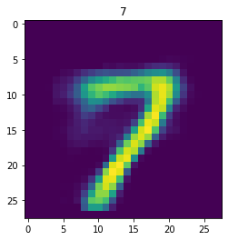


    ====> Epoch: 15 Average loss: 37.1374
    Epoch: 16 [20000/60000 (33%)]	Loss: 36.601738
    Epoch: 16 [40000/60000 (67%)]	Loss: 36.642373
    Epoch: 16 [60000/60000 (100%)]	Loss: 36.532485
    


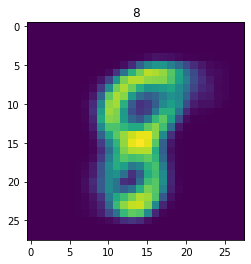


    ====> Epoch: 16 Average loss: 36.9795
    Epoch: 17 [20000/60000 (33%)]	Loss: 37.645845
    Epoch: 17 [40000/60000 (67%)]	Loss: 38.491716
    Epoch: 17 [60000/60000 (100%)]	Loss: 36.673926
    


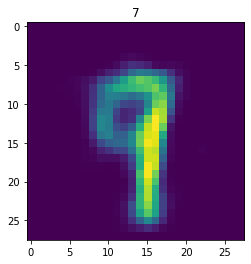


    ====> Epoch: 17 Average loss: 36.8425
    Epoch: 18 [20000/60000 (33%)]	Loss: 36.183394
    Epoch: 18 [40000/60000 (67%)]	Loss: 36.757959
    Epoch: 18 [60000/60000 (100%)]	Loss: 37.720042
    


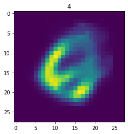


    ====> Epoch: 18 Average loss: 36.7152
    Epoch: 19 [20000/60000 (33%)]	Loss: 36.210232
    Epoch: 19 [40000/60000 (67%)]	Loss: 37.483999
    Epoch: 19 [60000/60000 (100%)]	Loss: 36.998501
    


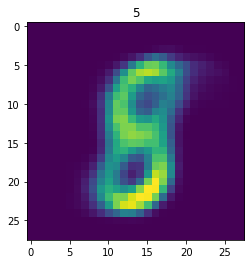


    ====> Epoch: 19 Average loss: 36.5916
    Epoch: 20 [20000/60000 (33%)]	Loss: 36.686836
    Epoch: 20 [40000/60000 (67%)]	Loss: 36.176907
    Epoch: 20 [60000/60000 (100%)]	Loss: 37.291575
    


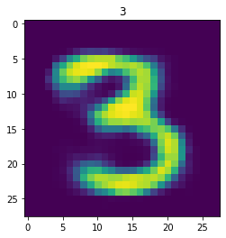


    ====> Epoch: 20 Average loss: 36.4815
    Epoch: 21 [20000/60000 (33%)]	Loss: 35.280510
    Epoch: 21 [40000/60000 (67%)]	Loss: 35.408699
    Epoch: 21 [60000/60000 (100%)]	Loss: 36.384626
    


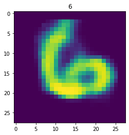


    ====> Epoch: 21 Average loss: 36.3850
    Epoch: 22 [20000/60000 (33%)]	Loss: 36.342734
    Epoch: 22 [40000/60000 (67%)]	Loss: 36.120286
    Epoch: 22 [60000/60000 (100%)]	Loss: 34.955454
    


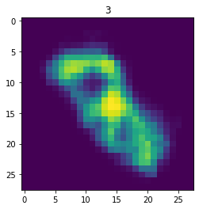


    ====> Epoch: 22 Average loss: 36.2792
    Epoch: 23 [20000/60000 (33%)]	Loss: 35.759111
    Epoch: 23 [40000/60000 (67%)]	Loss: 34.986384
    Epoch: 23 [60000/60000 (100%)]	Loss: 35.863618
    


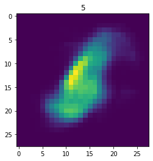


    ====> Epoch: 23 Average loss: 36.2050
    Epoch: 24 [20000/60000 (33%)]	Loss: 35.652568
    Epoch: 24 [40000/60000 (67%)]	Loss: 37.206226
    Epoch: 24 [60000/60000 (100%)]	Loss: 37.563311
    


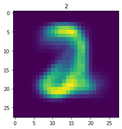


    ====> Epoch: 24 Average loss: 36.1336
    Epoch: 25 [20000/60000 (33%)]	Loss: 37.236667
    Epoch: 25 [40000/60000 (67%)]	Loss: 36.156731
    Epoch: 25 [60000/60000 (100%)]	Loss: 34.020962
    


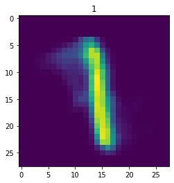


    ====> Epoch: 25 Average loss: 36.0415
    Epoch: 26 [20000/60000 (33%)]	Loss: 35.965017
    Epoch: 26 [40000/60000 (67%)]	Loss: 36.913325
    Epoch: 26 [60000/60000 (100%)]	Loss: 35.093923
    


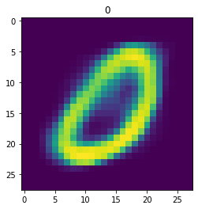


    ====> Epoch: 26 Average loss: 35.9669
    Epoch: 27 [20000/60000 (33%)]	Loss: 35.891963
    Epoch: 27 [40000/60000 (67%)]	Loss: 36.001890
    Epoch: 27 [60000/60000 (100%)]	Loss: 36.545264
    


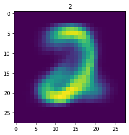


    ====> Epoch: 27 Average loss: 35.8938
    Epoch: 28 [20000/60000 (33%)]	Loss: 37.059600
    Epoch: 28 [40000/60000 (67%)]	Loss: 35.631221
    Epoch: 28 [60000/60000 (100%)]	Loss: 35.151846
    


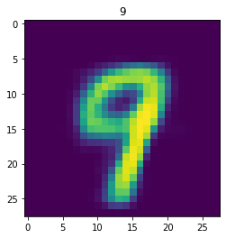


    ====> Epoch: 28 Average loss: 35.8239
    Epoch: 29 [20000/60000 (33%)]	Loss: 35.101321
    Epoch: 29 [40000/60000 (67%)]	Loss: 34.398643
    Epoch: 29 [60000/60000 (100%)]	Loss: 34.386650
    


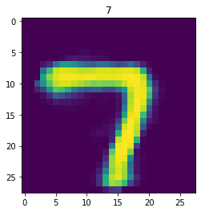


    ====> Epoch: 29 Average loss: 35.7588
    Epoch: 30 [20000/60000 (33%)]	Loss: 35.678657
    Epoch: 30 [40000/60000 (67%)]	Loss: 35.820137
    Epoch: 30 [60000/60000 (100%)]	Loss: 35.145249
    


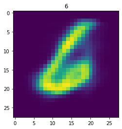


    ====> Epoch: 30 Average loss: 35.7031
    Epoch: 31 [20000/60000 (33%)]	Loss: 34.647329
    Epoch: 31 [40000/60000 (67%)]	Loss: 34.748079
    Epoch: 31 [60000/60000 (100%)]	Loss: 35.683723
    


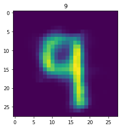


    ====> Epoch: 31 Average loss: 35.6446
    Epoch: 32 [20000/60000 (33%)]	Loss: 35.611414
    Epoch: 32 [40000/60000 (67%)]	Loss: 37.895881
    Epoch: 32 [60000/60000 (100%)]	Loss: 35.952639
    


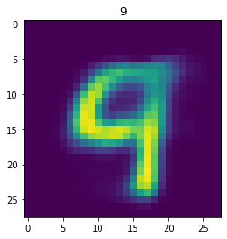


    ====> Epoch: 32 Average loss: 35.5910
    Epoch: 33 [20000/60000 (33%)]	Loss: 36.365115
    Epoch: 33 [40000/60000 (67%)]	Loss: 33.621260
    Epoch: 33 [60000/60000 (100%)]	Loss: 36.825591
    


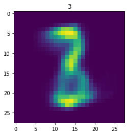


    ====> Epoch: 33 Average loss: 35.5494
    Epoch: 34 [20000/60000 (33%)]	Loss: 36.096372
    Epoch: 34 [40000/60000 (67%)]	Loss: 36.678503
    Epoch: 34 [60000/60000 (100%)]	Loss: 34.051584
    


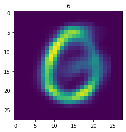


    ====> Epoch: 34 Average loss: 35.4977
    Epoch: 35 [20000/60000 (33%)]	Loss: 34.831150
    Epoch: 35 [40000/60000 (67%)]	Loss: 35.734529
    Epoch: 35 [60000/60000 (100%)]	Loss: 34.864536
    


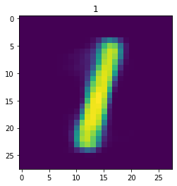


    ====> Epoch: 35 Average loss: 35.4564
    Epoch: 36 [20000/60000 (33%)]	Loss: 35.273062
    Epoch: 36 [40000/60000 (67%)]	Loss: 36.339285
    Epoch: 36 [60000/60000 (100%)]	Loss: 35.096025
    


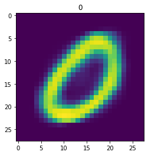


    ====> Epoch: 36 Average loss: 35.4226
    Epoch: 37 [20000/60000 (33%)]	Loss: 35.747583
    Epoch: 37 [40000/60000 (67%)]	Loss: 34.885400
    Epoch: 37 [60000/60000 (100%)]	Loss: 35.150825
    


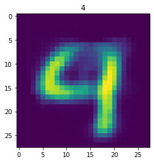


    ====> Epoch: 37 Average loss: 35.3787
    Epoch: 38 [20000/60000 (33%)]	Loss: 35.365684
    Epoch: 38 [40000/60000 (67%)]	Loss: 35.076494
    Epoch: 38 [60000/60000 (100%)]	Loss: 35.274106
    


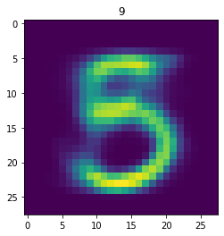


    ====> Epoch: 38 Average loss: 35.3375
    Epoch: 39 [20000/60000 (33%)]	Loss: 33.656929
    Epoch: 39 [40000/60000 (67%)]	Loss: 34.410693
    Epoch: 39 [60000/60000 (100%)]	Loss: 35.632637
    


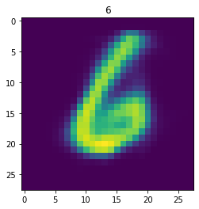


    ====> Epoch: 39 Average loss: 35.3154
    Epoch: 40 [20000/60000 (33%)]	Loss: 35.789722
    Epoch: 40 [40000/60000 (67%)]	Loss: 36.411433
    Epoch: 40 [60000/60000 (100%)]	Loss: 36.640859
    


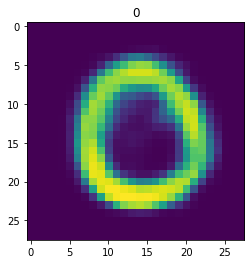


    ====> Epoch: 40 Average loss: 35.2726
    Epoch: 41 [20000/60000 (33%)]	Loss: 36.135540
    Epoch: 41 [40000/60000 (67%)]	Loss: 33.705623
    Epoch: 41 [60000/60000 (100%)]	Loss: 36.202119
    


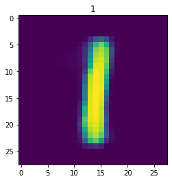


    ====> Epoch: 41 Average loss: 35.2119
    Epoch: 42 [20000/60000 (33%)]	Loss: 35.541836
    Epoch: 42 [40000/60000 (67%)]	Loss: 35.629856
    Epoch: 42 [60000/60000 (100%)]	Loss: 34.619102
    


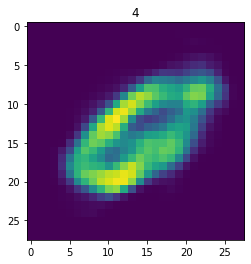


    ====> Epoch: 42 Average loss: 35.1965
    Epoch: 43 [20000/60000 (33%)]	Loss: 35.975867
    Epoch: 43 [40000/60000 (67%)]	Loss: 34.694214
    Epoch: 43 [60000/60000 (100%)]	Loss: 34.779368
    


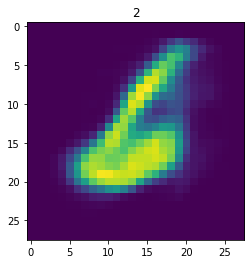


    ====> Epoch: 43 Average loss: 35.1655
    Epoch: 44 [20000/60000 (33%)]	Loss: 34.862920
    Epoch: 44 [40000/60000 (67%)]	Loss: 35.202686
    Epoch: 44 [60000/60000 (100%)]	Loss: 35.154026
    


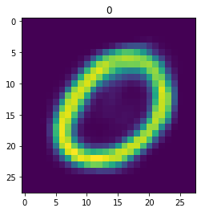


    ====> Epoch: 44 Average loss: 35.1412
    Epoch: 45 [20000/60000 (33%)]	Loss: 35.493105
    Epoch: 45 [40000/60000 (67%)]	Loss: 34.763962
    Epoch: 45 [60000/60000 (100%)]	Loss: 36.250828
    


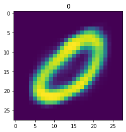


    ====> Epoch: 45 Average loss: 35.1256
    Epoch: 46 [20000/60000 (33%)]	Loss: 35.688271
    Epoch: 46 [40000/60000 (67%)]	Loss: 36.289146
    Epoch: 46 [60000/60000 (100%)]	Loss: 35.851013
    


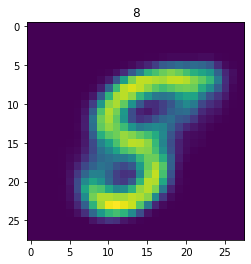


    ====> Epoch: 46 Average loss: 35.0912
    Epoch: 47 [20000/60000 (33%)]	Loss: 34.039561
    Epoch: 47 [40000/60000 (67%)]	Loss: 36.419995
    Epoch: 47 [60000/60000 (100%)]	Loss: 34.943896
    


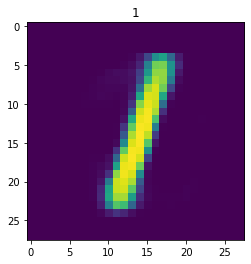


    ====> Epoch: 47 Average loss: 35.0557
    Epoch: 48 [20000/60000 (33%)]	Loss: 33.076106
    Epoch: 48 [40000/60000 (67%)]	Loss: 36.028267
    Epoch: 48 [60000/60000 (100%)]	Loss: 35.647769
    


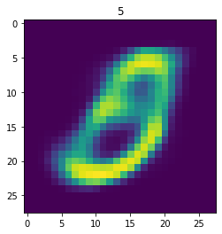


    ====> Epoch: 48 Average loss: 35.0177
    Epoch: 49 [20000/60000 (33%)]	Loss: 36.092920
    Epoch: 49 [40000/60000 (67%)]	Loss: 36.263647
    Epoch: 49 [60000/60000 (100%)]	Loss: 34.410708
    


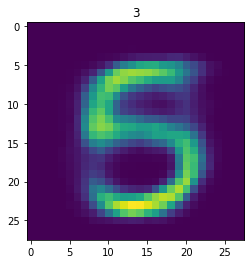


    ====> Epoch: 49 Average loss: 35.0090
    Finished Training
    

We can visualize the latent space by evaluating the training samples and then save the resulting mean value for $\mathbf z$


```python
Zx = [[] for i in range(10)]
Zy = [[] for i in range(10)]
for i in range(len(mnist_trainset)):
    μ,σ = vae.encode(torch.stack((mnist_trainset[i][0].flatten(),mnist_trainset[i][0].flatten())))
    Zx[mnist_trainset[i][1]].append(μ[0].detach().numpy()[0])
    Zy[mnist_trainset[i][1]].append(μ[0].detach().numpy()[1])
```


```python
fig = plt.figure(figsize=(12, 12),dpi=80)

ax = fig.add_subplot()
N = 250

C = ['b','g','r','c','m','y','brown','black','orange','pink']
for i in range(10):
    ax.scatter(Zx[i][:N],Zy[i][:N],label=i,alpha=0.5,color=C[i])
    
for i in range(0,10,-1):
    plt.scatter(Zx[i][N:2*N],Zy[i][N:2*N],label=i,alpha=0.5,color=C[i])

plt.legend()
plt.title("Latent Representation of Handwritten Digits")
plt.show()
```


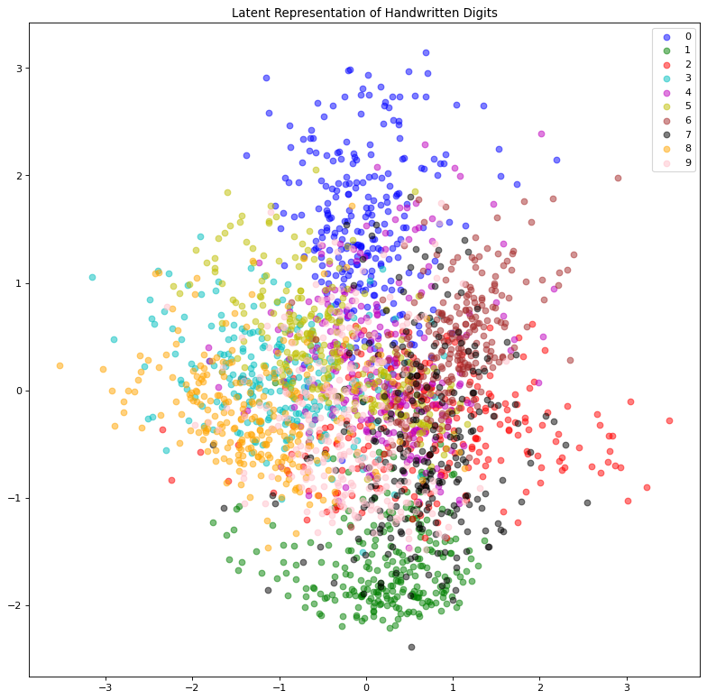


We can also use this to to see how well it will produce a handwritten digit with a specified label.


```python
for i in range(20):

    sample_idx = np.random.randint(len(mnist_trainset))
    while (mnist_trainset[sample_idx][1]) != 8:
        sample_idx = np.random.randint(len(mnist_trainset))
    
    μ,σ = vae.encode(torch.stack((mnist_trainset[sample_idx][0].flatten(),mnist_trainset[sample_idx][0].flatten())))
    z,ϵ = vae.sample(μ,σ)
    x = vae.decode(z.unsqueeze(dim=1))
    plt.imshow(x[1].detach().numpy().reshape(28,28))
    plt.title("Expected #"+ str(mnist_trainset[sample_idx][1]))
    plt.show()
```


Sources: 

1. https://arxiv.org/pdf/1906.02691.pdf
2. Bishop Pattern Recognition and Machine Learning
3. Wikipedia


```python

```
